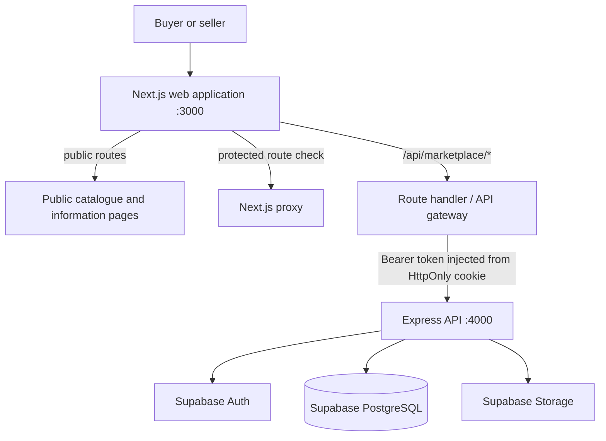

# Marketplace

## Story behind the project

As a student, I often found myself needing essential items urgently, whether it was something for class, accommodation, or everyday campus life. Most students rely on WhatsApp groups where other students and small businesses advertise products or services.

However, these groups have clear limitations. Posts can easily get buried, sellers only reach a small audience, and buyers are limited to whatever happens to be shared in the group at that moment.

Marketplace was created to solve that problem. It gives students a dedicated platform where they can discover products and services from student sellers around their campus or nearby area, making buying and selling faster, easier, and more accessible.

## Full-Stack Marketplace Platform

An application developed as two connected components: a **Next.js web application** and an **Express API** backed by **Supabase**.

The project demonstrates my approach to separating frontend concerns from backend services while building functionality around core components that make up the application.

### Architecture

The web app is the browser-facing boundary. It serves public pages, protected buyer pages and seller pages. Its catch-all route handler forwards marketplace requests to Express, keeping browser traffic on a same-origin `/api/marketplace/*` path. Express owns the versioned application contract and uses Supabase for identity, PostgreSQL data and object storage.

### Technology

- **Frontend:** Next.js, React, TypeScript
- **Backend:** Node.js, Express 5
- **Database:** PostgreSQL through Supabase
- **Authentication:** Supabase Auth
- **Storage:** Supabase Storage
- **Development:** Docker, Supabase CLI, npm
- **Testing:** Vitest, Supertest

### Key functionality

- Product discovery, search, filtering, sorting and pagination
- Seller-owned inventory management
- Product creation, editing and deletion
- Product image management
- Authenticated-user endpoints
- Seller access control
- API health checks
- Local Supabase development environment
- Automated tests and smoke/acceptance scripts

### Engineering approach

The API is organised into distinct layers including **routes, controllers, middleware, HTTP handling, configuration and error handling**. This keeps request routing separate from application logic and makes the backend easier to extend.

The project also uses server-only privileged credentials rather than exposing them to the browser.

### Repositories

[Marketplace Web](https://github.com/MakomaneTau/marketplace-web){ .md-button }
[Marketplace API](https://github.com/MakomaneTau/marketplace-api){ .md-button }
[Marketplace DOCS](https://makomanetau.github.io/marketplace-docs){ .md-button }

## Why this project matters

Technically, Marketplace is one of my strongest demonstrations of **backend and full-stack engineering** because it combines application architecture, authentication, database operations, storage, API design, testing and local infrastructure in one system.

Conceptually, Marketplace takes an everyday problem and turns it into a more accessible, scalable platform, helping local sellers reach more people while giving buyers a simpler way to discover and support businesses around them.
